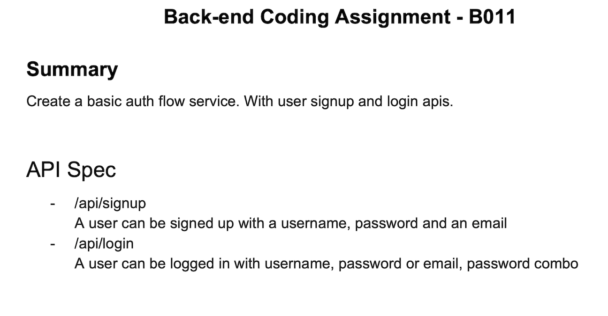
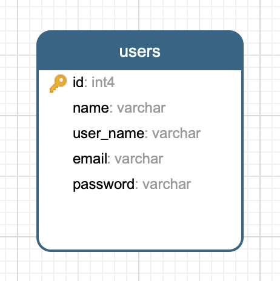

# JWT Auth Service #

 

Demonstration of Requirements understanding, proposing a solution and implementation by using the latest tools and techniques.

---

## Distribution ##

 - **[Swagger API Docs - Deployed on Kubesail](https://jwt-auth-service.naeemark.usw1.kubesail.org/swagger-ui.html)** - **Bonus Requirement**
 - A [Postman Collection](https://www.getpostman.com/collections/828a77388af0f03f51bc) is available for all the API's (live).
 - **[API Integrations FrontEnd Demo - Heroku Deployment](https://jwt-auth-webapp-service.herokuapp.com/)** - **Bonus Requirement**
 - **[ReactFrontAppRepository](https://github.com/naeemark/jwt-auth-webapp-service.git)** (WIP) - **Bonus Requirement**
 - A [docker repository](https://hub.docker.com/repository/registry-1.docker.io/naeemark/aa-jwt-auth-service) is created, latest image can be downloaded
 - **[Sonar Project](https://sonarcloud.io/dashboard?id=naeemark_jwt-auth-service)** - **Bonus Requirement**
 - **[Kubesail - Deployment File](.kubesail/deployment.yml)** - **Bonus Requirement**

---

### What is this repository for? ###

* This app is built as assignment for AirAsia - KL. 
* Adds different libs to enhance the application quality and performance.
* Using [SWAGGER.IO](www.swagger.io) for documentation and as a working REST-API client
* CI/CD Demonstration using [Github Actions](https://github.com/features/actions)
* Docker containers are used for Build Deployment
* The live environment is established on [KubeSail](https://kubesail.com/) as per the instructions
* Version 1.0.0

---

### Problem Statement:

---
### Proposed Schema:

- By keep the provided instructions in mind, I would prefer to use a [Spring Boot](https://www.tutorialspoint.com/spring_boot/spring_boot_introduction.htm) application for the implementation of required functionality.
- Postgres Database will be used for Dev, Test and Prod environments.
- For unit testing, I would prefer to use JUnit

#### Entities ####
- It is clear by the requirements that there will be `One` entity
    * **Users**
- As we have already finalized the attributes of the Entity, so, IMO, RDBM is fine for the situation
    - The `user_name` and `email` both should be unique attributes     

### Proposed Schema:

### Deliverable Content ###

#### Functional Implementation ####
 * **POST** `{baseURL}/api/signup` - returns the `accessToken` asn User attribute
 * **POST** `{baseURL}/api/login` - returns the `accessToken` asn User attribute 
 ---
#### Non-Functional Implementation ####
 * **GET** `{baseURL}/api/health` - Checks the health of the system,
 * **GET** `{baseURL}/api/user` - Gets the User object based on provided JWT in header
 
 
### Development Cycle:
- Distributes the whole development into Small tasks
- [Each Issue](https://github.com/naeemark/jwt-auth-service/issues?q=is%3Aissue) shows a feature
- [Each commit](https://github.com/naeemark/jwt-auth-service/commits/master) shows a small progress
- [Pull Requests](https://github.com/naeemark/jwt-auth-service/pulls?q=is%3Apr+is%3Aclosed) are done for major tasks
 
## How do I get set up? ##

### How to set up ###
To set-up the project locally you need to clone this repo, from `master` or `develop` branch or some latest `TAG`

### Configuration ###
- Please sync and resolve the `maven` dependencies
- Run `mvn clean install`
- To run tests `mvn clean test`

##### Build Docker Image
- `docker build -t jwt-auth-service .`

##### Run Docker Image
- Run `docker run -d -p 80:8080 jwt-auth-service`
- You may access the running docker app on [`http://localhost/swagger-ui.html`](http://localhost/swagger-ui.html)

##### Run Docker Image From Docker hub
- **[Docker Image Repository](https://hub.docker.com/repository/docker/naeemark/aa-jwt-auth-service)**
- Run `docker run -d --name jwt-auth-service -p 80:8080 naeemark/aa-jwt-auth-service`
- You may access the running docker app on [`http://localhost/swagger-ui.html`](http://localhost/swagger-ui.html)

##### Stop Docker Container
- Run `docker kill {container-id}`

### Pre-reqs
- JDK 1.8
- Spring Boot
- Docker
- Postgres
- JWT
- Junit
- IntelliJ IDEA

### Tools Included
- Jacoco
- Sonar
- Swagger
- JPA
- Hibernate
- Github Actions
- KubeSail

#### Auth ####
- JWT Tokens are used as authorization

## External Tools: ##

- **[Github Actions](https://github.com/features/actions)**
- **[Docker](https://www.docker.com/)**
- **[SonarCould](https://sonarcloud.io/)**
- **[KubeSail](https://kubesail.com/)**
- **[Heroku](https://heroku.com/)**

## Deployment

- When a `pull request` is merged in `master`, `Github Action` starts and following steps are done by automated CI/CD:
    - Creates Environment and Runs all tests
    - Complete a SonarQube analysis and pushes the results to **[Live Project](https://sonarcloud.io/dashboard?branch=develop&id=naeemark_jwt-auth-service)**
    - Makes a deployment to Github packages (Mock)
    - Creates the Docker Image and pushes to [Docker Repository](https://hub.docker.com/repository/registry-1.docker.io/naeemark/aa-jwt-auth-service)
    
- As a next step, login to [KubeSail](https://kubesail.com/) instance and deploy accordingly

## Contribution guidelines ##

- Forks are always appreciated

